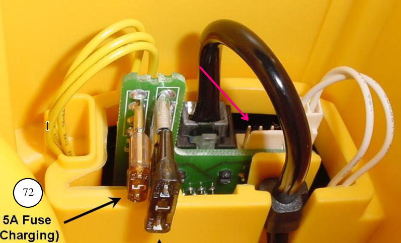

# General parameters of the Robomow RL-2000 (City 120) robot - user terminal communication
 * 0-5V levels between the PIC in the terminal and the H8S/2000 in the robot
 * 19200 baud 8n1 inverted (UART idles at low)
 * Checksum: sum all bytes then negate
 * For RJ11 pinout see the [revenged schematics](https://github.com/martonmiklos/robomow_city120_reveng/blob/master/robomow_city120_terminal.sch)
 
 J105 pinout:
 RX1: 4
 TX1: 5
 RX0: 2
 TX0: 3
 GND: 8
 
# Terminal response packets

Terminal sends the following packets periodically (with varying -depending on the traffic from the robot- rate between 10-60ms). 
I never saw traffic on the TX and RX at the same time (the terminal and the robot seems to be handshaking on the bus).

```
* Idle:     0x23 0x00 0x18 0xC4
* Forward:  0x23 0x40 0x18 0x84
* Backward: 0x23 0x80 0x18 0x44
* Left:     0x23 0x10 0x18 0xB4
* Right:    0x23 0x20 0x18 0xA4
* Rabbit:   0x23 0x00 0x19 0xC3
* C:        0x23 0x08 0x18 0xBC
* Go:       0x23 0x04 0x18 0x44
* Stop:     0x23 0x00 0x1A 0xC2
* Factory:  0x23 0x00 0x1C 0xC0
* Up:       0x23 0x01 0x18 0xC3
* Down:     0x23 0x02 0x18 0xC2
```

# HW reverse engineering info

I currently have the following boards:
* ESB0019B04 - broken
* ESB0050D - broken
* ESB0100D - likely new

## H8S MCU mode strapping

Strapped to Mode 5
- MD0 VCC
- MD1 GND
- MD2 VCC

## I2C EEPROM

SDA - P53
SCL - P52

## External RAM

64KByte

## Current limit on motors

Shunts wired to LM393-s which output is read via 74HC153 muxes, mapping of them is TBD

# Firmware reversing info

## RAM

### Internal RAM
2K on chip RAM present between 0xFFF400 to 0xFFFC00

### External RAM
The contents of the external RAM is initialized from the flash in multiple portions

- ROM 0x01007E-0x0101F2 copied to RAM 0x221140-0x2212B4 (372 byte)
- ROM 0x010570-0x0113A8 copied to RAM 0x2212B4-0x2220EC (3640 byte)

## UART 0

UART0 is connected to the terminal, has 31 byte RX buffer

### UART 1

The UART1 is initialized to 4800 baud (F_CPU == 16M, BRR1 == 103), the baud rate is adjustable with some commands.

Physically this UART is wired to this connector:



The UART1 looks to have simpler protocol, and it might be involved in bootloader/flashing/config upload activites (it ends in one case using a "DownLoad..." string).

### UART1 protocol info

The following info gathere by analyzing the 4.33 City-120 firmware in IDA.

Never tested it due ot the danger insisted by the DownLoad string.

0. byte: 
    if 0xAA - process the 6. byte
    if 0x83, 0x87, 0x89 - next byte needs to be 'm'
    if 0xC4 - process the 3. byte
    if 0x68 - (ascii 'h') the activates some sort of 
1. byte: if not 'm' (0x6D) then reset processing for 0x83, 0x87, 0x89
2. byte
    if 0x83, 0x87 then proceeds to some section leading to a DownLoad string.
3. byte
    if 0xC5 - follows processing
    else - resets packet processing
4. byte
    if 0xC7 - perform BIST
5. byte
    itt meghívódik egy komolyabb függvény
6. byte
    eltároljuk -> 7.re

